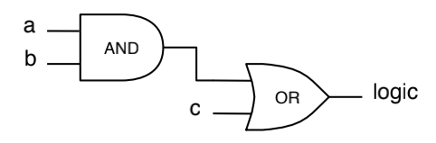
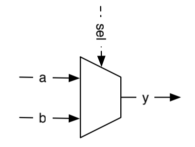

# Ch4基本组成部分

​	在这个章节中，我们介绍数字设计的基本组成部分：组合逻辑电路和寄存器。这些基本元素可以组合构成更大更有趣的电路。

​	数字系统总体使用二进制信号，这意味着单个比特只能有两个可能的取值，0或1。我们也常用低电平/高电平，假/真和非声明的/已声明的表示。这些术语的含义是相通的，指的都是一个二进制信号的两个可能取值。

## 4.1信号类型和常量

​	Chisel提供了三种数据类型来描述信号、组合逻辑和寄存器：Bits、UInt和SInt。UInt和SInt是Bits的扩展，而且三种类型都表示比特的矢量。UInt表示这个bits的矢量是一个无符号整型，与之相对的，SInt表示一个有符号的整型。Chisel使用二进制补码表示有符号整数。以下是不同类型的定义，一个8位Bits、一个8位无符号整数和一个10位有符号整数：

```scala
Bits(8.W)
UInt(8.W)
SInt(10.W)
```

​	Bits的矢量宽度被Chisel的width类型定义。以下表示把Scala的整型n转换成Chisel的width，用于Bits矢量的定义：

```scala
n.W
Bits(n.W)
```

​	常量可以通过Scala整形定义并转换成Chisel类型：

```scala
0.U
-3.S
```

​	常量也可以使用Chisel的width类型随着宽度定义：

```scala
8.U(4.W)
```

​	你也许会觉得8.U和4.W这样的表示有些滑稽，把它当作一个带有类型的整数常量变量。这种表示很类似C、Java或者Scala中的长整型。

​	常见问题：一个可能出现的错误是，当我们想要定义一个确定宽度的常量但是丢失了.W。例如，1.U(32)不会定义一个32位宽的常量表达，而是将表达式(32)解释成从位置32提取的比特，结果会给出单比特常量0，这并不是编程者的本意。

​	Chisel受益于Scala的类型判断，而且在很多地方类型信息可以被忽略。对于位宽也是如此。在多数情况下，Chisel会自动推断正确的位宽。因此，Chisel描述的硬件往往比Verilog和VHDL描述的更加简洁，可读性也更强。

​	对于以其他进制定义的常量，常量定义为带前缀的字符串，十六进制前缀为h，八进制前缀为o，二进制前缀为b。下面的例子展示了不同进制下常量255的定义。这个例子中，我们忽略了位宽让Chisel推断符合常量条件的最小位宽，此例中为8位。

```scala
"hff".U
"o377".U
"b1111_1111".U
```

​	以上代码也展示了如何使用下划线来组合字符串中表示常量的数字。下划线是被忽略的。

​	为了表示逻辑值，Chisel定义了Bool类型。Bool可以表示true或false。以下的代码通过将Scala的Boolean常量true和false转换成Chisel的Bool类型常量展示了Bool类型的定义和Bool常量的定义。

```scala
Bool()
true.B
false.B
```

## 4.2组合电路

​	Chisel和C、Java、Scala以及其他的很多编程语言中定义的一样使用布尔代数操作符描述组合电路：$\&$是与运算，$|$是或运算。下面一行代码定义了一个使用与门组合信号a和b再将结果与信号c进行或运算的例子。

```scala
val logic = a & b | c
```



<center style="color:#c0c0c0">图4.1 表达式逻辑图</center>

​	图4.1展示了上述逻辑表达式的草图。注意电路可能用于表示一个比特矢量，并不仅仅是单线与或门组成的逻辑电路。

​	在这个例子中，我们不定义既不定义类型，也不置顶单个逻辑的宽度。这两者都由表达式的类型和宽度推理出来。Chisel中标准的逻辑操作如下：

```scala
val and = a & b
val or = a | b
val xor = a ^ b
val not = ~a
```

​	算数操作使用标准运算符：

```scala
val add = a + b
val sub = a - b
val neg = -a
val mul = a * b
val div = a / b
val mod = a % b
```

​	对于加法和减法运算，结果的宽度是操作数的最大宽度。乘法运算的结果的宽度是两个操作数的位宽之和。通常除法和取余运算的结果宽度是被除数的位宽。

​	一个信号也可以被定义成某种类型的导线(Wire)。我们可以使用:=更新符给导线赋值。

```scala
val w = Wire(UInt())
w := a&b
```

​	单比特可以使用如下形式提取：

```scala
val sign = x(31)
```

​	一个子域可以从终点到起点位置提取：

```scala
val lowBits = largeWord(7, 0)
```

​	比特域通过Cat合并：

```scala
val word = Cat(highByte, lowByte)
```

| 操作符    | 描述                           | 数据类型                 |
| --------- | ------------------------------ | ------------------------ |
| * / %     | 乘法、除法、取余               | Uint, SInt               |
| + -       | 加法、减法                     | Uint, SInt               |
| === =/=   | 等于判断，不等于判断           | Uint, SInt, returns Bool |
| > >= < <= | 大于、大于等于、小于、小于等于 | Uint, SInt, returns Bool |
| <<  >>    | 左移、右移                     |                          |
| ~         | 非                             | Uint, SInt, Bool         |
| & \| ^    | 与、或、异或                   | Uint, SInt, Bool         |
| !         | 逻辑非                         | Bool                     |
| && \|\|   | 逻辑与，逻辑或                 | Bool                     |

<center style="color:#c0c0c0">表4.1 Chisel定义的硬件操作</center>

​	表4.1展示了操作符号的列表。Chisel操作符优先级取决于电路的赋值顺序，遵守Scala 操作符优先级。如果搞不清楚，使用括号会是很好的习惯。

| 函数                | 描述          | 数据类型                 |
| ------------------- | ------------- | ------------------------ |
| v.andR v.orR v.xorR | 与或非        | Uint, SInt, returns Bool |
| v(n)                | 提取单比特    | Uint, SInt               |
| v(end, start)       | 比特域提取    | Uint, SInt               |
| Fill(n, v)          | 比特串复制n次 | Uint, SInt               |
| Cat(a, b, ...)      | 比特域合并    | Uint, SInt               |

<center style="color:#c0c0c0">表4.2 Chisel定义的硬件函数，由v唤醒</center>

​	表4.2展示了Chisel数据类型的多种函数定义。

### 4.2.1 多选器

​	多选器是一个选择选项的电路。在最基本的形式中，它会在两条路径中选择一条。图4.2展示了这样一个二选一多选器，简称为mux。信号y最终表示信号a还是信号b取决的选择信号sel。



<center style = "color:#c0c0c0">图4.2 一个基本的二选一多选器</center>

​	一个多选器可以通过逻辑构建。但是，因为多选器是很标准的运算，Chisel提供了一个多选器。

```scala
val result = Mux(sel, a, b)
```

​	当sel位true时选择a，否则选择b。sel是Chisel定义的Bool型信号；输入a和b可以是任意Chisel基本类型或者集合(捆束或矢量)，只要二者类型相同即可。

​	通过逻辑运算、算数操作以及一个多选器，可以描述任意组合电路。但是，Chisel提供更多的部件和控制抽象用于更优雅地描述组合电路，这会在之后的章节中提到。

​	第二个需要用于描述数字电路的基本部件是状态元素，也叫做寄存器，下面进行介绍。

## 4.3状态寄存器

​		Chisel提供了一个寄存器，这是一个D触发器的集合。寄存器隐式地连接到一个全局时钟并且沿上升沿更新。当在寄存器声明时提供一个初始值，此寄存器使用一个连接到全局复位信号的同步复位信号。

​	一个寄存器可以是任何能够以比特集表示的Chisel类型。下列代码定义了一个复位到0的8位寄存器。

```scala
val reg = RegInit(0.U(8.W))
```

​	一个输入通过:=运算符连接到寄存器，寄存器的输出可以仅通过表达式中的名字调用。

```scala
reg := d
val q = reg
```

​	寄存器也可以通过如下定义连接到输入：

```scala
val regNxt = RegNext(d);
```

​	也可以连接到它的输入并使用一个常量作为定义中的初始值：

```scala
val bothReg = RegNext(d, 0.U)
```

​	为了区分表示组合逻辑和寄存器的信号，一个常用的方法是在寄存器的名字上加上后缀Reg。另一个常用的方法来自Java和Scala，使用驼峰命名法。这种方法在函数和变量名开头使用小写字母开头，在类名上则使用大写字母开头。

### 4.3.1计数

​	计数是一个数字系统中的基本操作。计数可能经常被用到。但是，很多情况下计数都被用来定义时钟间隔。计数时钟并在时钟间隔过去时诱发一个操作。

​	一个简单的方式是计数到一个值。但是，在计算机科学中和数字设计中，计数都从0开始。因此，如果我们想要数10个数，我们从0数到9。下面的代码展示了这样一个数到9的计数并且当到达9时返回0.

```scala
val cntReg = RegInit(0.U(8.W))
cntReg = Mux(cntReg === 100.U, 0.U, cntReg + 1.U)
```

## 4.4使用Bundle和Vec进行构造
